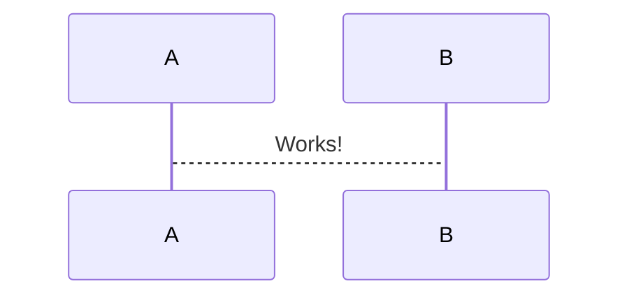

# start or create file

Start or create a new file to generate.

```
fileManager.CreateNewFile(filename, projectname, subfolders, properties);
```

Content of this file ends with next call of method above or with generating method ([proceed-to-generate-files](proceed-to-generate-files.md)).

## parameters

### filename (string)

The name of started file.

*Example: "test.cs"*

### projectname (string)

The name of the project, where should be generate the file.

*Example*: "Test"

### subfolders (string)

Subfolders starting point from project root.

*Example: Path.Combine("Example", "Tests")*

| Parameter   | Type                       | Description                                                  | Exmaple/Value                                                |
| ----------- | -------------------------- | ------------------------------------------------------------ | ------------------------------------------------------------ |
| filename    | string                     | The name of started file.                                    | "test.cs"<br />required value, should NOT BE *null*          |
| projectname | string                     | The name of the project, where should be generate the file.  | "Test.Business"<br />*null* = project name of current project |
| subfolders  | string                     | Subfolders starting point from project root.                 | Path.Combine("Example", "Tests")<br />*null* = root of project |
| properties  | Dictionary<string, object> | Adding visual studio properties as example "CustomTool" or "CopyToOutputDirectory". | var settings = new Dictionary<string, object>();<br />settings.Add("CopyToOutputDirectory", 1)<br />*null* = no properties set |

#### properties

There are some defined values for the **Property**:

```
Property.CopyToOutputDirectory
Property.BuildAction
Property.CustomTool 
Property.CanOverwriteExistingFile
```

Values for **CopyToOutputDirectory**:

```
CopyToOutputDirectory.DoNotCopy
CopyToOutputDirectory.CopyAlways
CopyToOutputDirectory.CopyIfNewer
```

Values for **BuildAction**:

```
BuildAction.None
BuildAction.CSharpCompiler
BuildAction.Content
BuildAction.EmbeddedResource
```

Values for **CanOverwriteExistingFile**:

```
CanOverwriteExistingFile.Yes
CanOverwriteExistingFile.No
```

#### *Example* 

```
var settings = new Dictionary<string, object>();
settings.Add(Property.CopyToOutputDirectory, CopyToOutputDirectory.CopyAlways);
```

## *compatibility to old FileManager*

```
fileManager.StartNewFile(filename, projectname, subfolders, propertiesFromOldFileManager);
```

**Important: Optional parameters not exists in new file manager because is not working for Visual Studio 2017. Clean up optional parameters for new file manager.**

